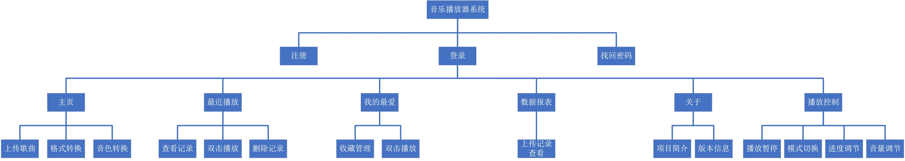
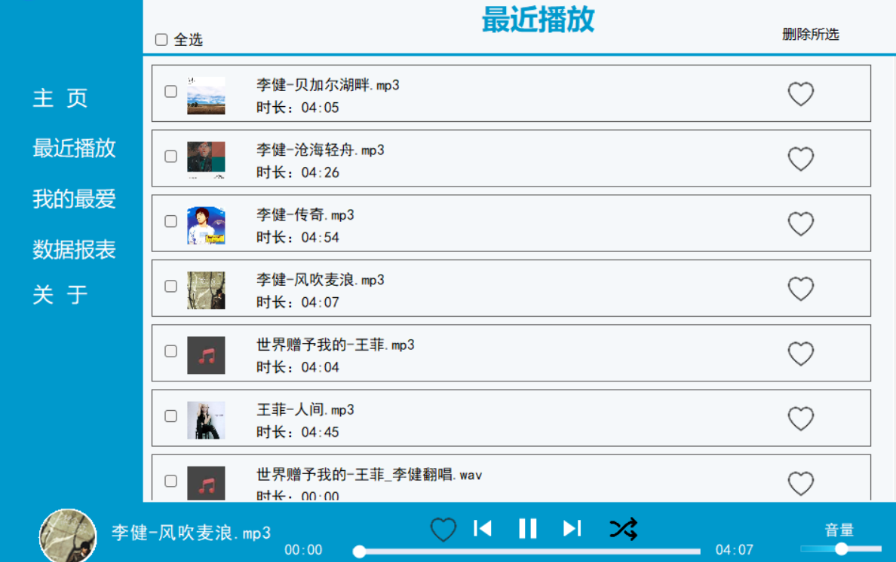
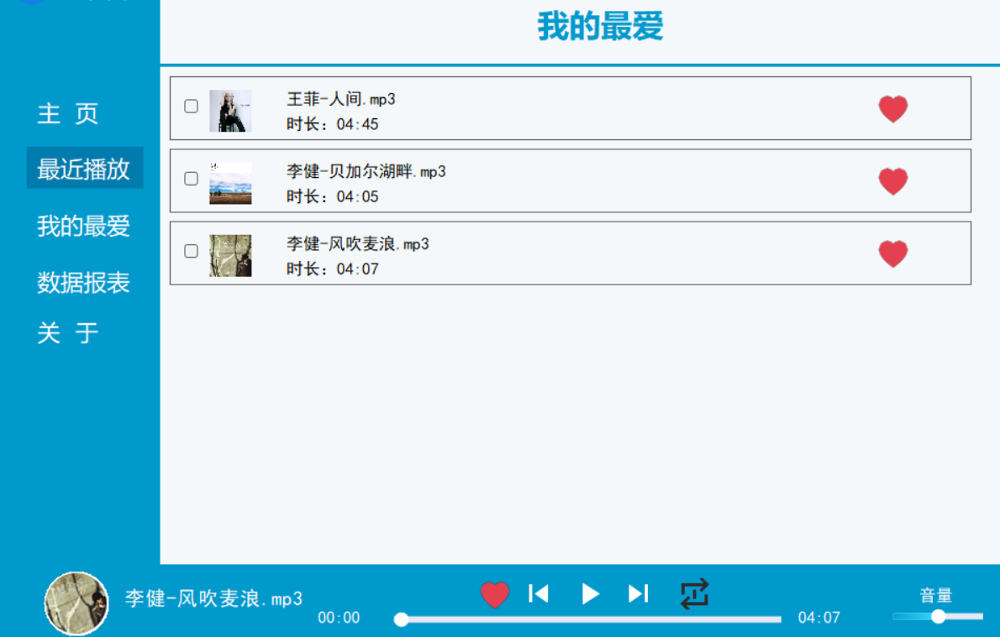
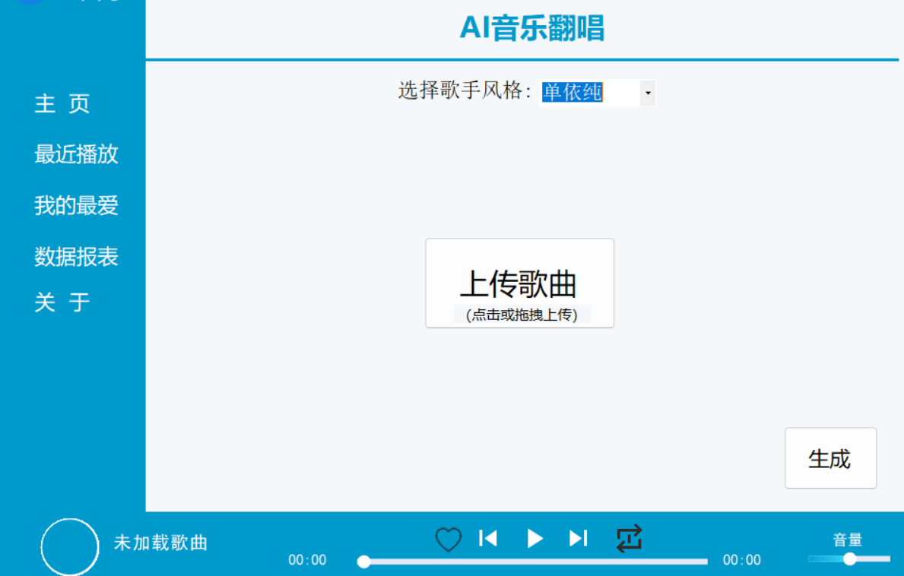

<div align="center">

# MusicAI

**A Windows desktop music library with playback, reporting and local AI audio-processing integration.**

`C#` · `.NET Framework 4.8` · `WinForms` · `SQL Server` · `FFmpeg` · `RVC`

</div>

<p align="center">
  
</p>

MusicAI is a five-project Windows solution covering user accounts, music-library management, playback history, reporting, upload workflows and local voice conversion. The application separates domain models, data access, business services, shared utilities and the WinForms interface.

## Highlights

- **SQL Server-backed library** for users, songs, favourites, uploads and recent plays.
- **Layered desktop architecture** with repository and service interfaces around the main workflows.
- **Listening reports** rendered through ReportViewer from database-backed aggregates.
- **Audio metadata** and embedded artwork through TagLibSharp.
- **Local AI audio processing** through an HTTP bridge to an RVC inference service.
- **Credential protection** with BCrypt password hashing.

<table>
<tr>
<td width="50%"></td>
<td width="50%"></td>
</tr>
<tr>
<td colspan="2"></td>
</tr>
</table>

## Solution architecture

| Project | Responsibility |
| --- | --- |
| `Models/` | Domain entities and data-transfer objects |
| `DAL/` | Repository implementations and ADO.NET database access |
| `BLL/` | User, song and reporting services behind interfaces |
| `Common/` | Cryptography, hashing, email and audio utilities |
| `UI/` | WinForms screens, panels and custom-drawn controls |

The main data workflows are exposed through interfaces such as `IUserRepository`, `IReportRepository` and `IUserFavoritesRepository`. Favourites and recent plays are persisted as database entities, while media metadata and cover art remain attached to the source audio files.

## Audio and reporting workflows

```text
local audio file
      │
      ├────────► TagLib metadata and artwork
      ├────────► library and playback records
      └────────► local RVC service at :7899

SQL Server ──► ReportRepository ──► ReportViewer dashboards
```

The voice-conversion screen sends an audio file to `http://localhost:7899/run/infer_convert`, keeping inference outside the desktop process while presenting it as part of the application workflow.

## Build and run

### Requirements

- Visual Studio with .NET Framework 4.8 support
- SQL Server and SQL Server Management Studio
- NuGet package restore
- A local RVC inference service for voice conversion

### Setup

1. Open `src/MusicAI.sln` in Visual Studio.
2. Restore the NuGet packages.
3. Open `database/schema.sql`, adjust the SQL Server data-file paths and execute the script.
4. Build and run the `UI` project.
5. Register the first user inside the application.

<details>
<summary>UI and reporting dependencies</summary>

The solution references DevExpress components, Microsoft ReportViewer and TagLibSharp. DevExpress and ReportViewer binaries are not redistributed; use licensed local installations when building the corresponding UI and reporting layers.

The database schema is committed without seed or user data. Voice conversion becomes available when a compatible local RVC service is running on port `7899`.

</details>

## Repository structure

```text
src/             five-project Visual Studio solution
database/        SQL Server schema
docs/screenshots portfolio visuals
```

## Project context

Designed and implemented independently as a course project from April to June 2025.

## License

Released under the [MIT License](LICENSE).
